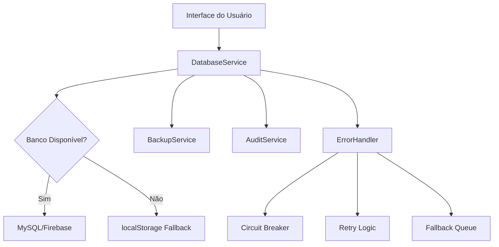

# 🚀 Guia de Migração - Sistema de Banco de Dados Persistente

## Visão Geral

Este documento fornece instruções completas para migrar o sistema ClientKey do armazenamento em localStorage para um banco de dados persistente com recursos avançados de backup, auditoria e tratamento de erros.

## 📋 Índice

1. [Arquitetura do Sistema](#arquitetura-do-sistema)
2. [Instalação e Configuração](#instalação-e-configuração)
3. [Processo de Migração](#processo-de-migração)
4. [Recursos Implementados](#recursos-implementados)
5. [Troubleshooting](#troubleshooting)
6. [Monitoramento e Manutenção](#monitoramento-e-manutenção)

## 🏗️ Arquitetura do Sistema

### Componentes Principais

```
database/
├── connection.js          # Gerenciador de conexões (MySQL/Firebase/localStorage)
├── schema.sql            # Estrutura das tabelas do banco
├── models/               # Modelos de dados
│   ├── Client.js         # Modelo de clientes
│   ├── Activity.js       # Modelo de atividades
│   └── Keyword.js        # Modelo de palavras-chave
├── services/             # Serviços do sistema
│   ├── DatabaseService.js    # Serviço principal
│   ├── BackupService.js      # Sistema de backup
│   ├── AuditService.js       # Logs de auditoria
│   └── ErrorHandler.js      # Tratamento de erros
├── migration/            # Sistema de migração
│   └── DataMigration.js  # Migração de dados
└── test/                 # Testes e validação
    └── database-test.html # Interface de testes
```

### Fluxo de Dados



## 🛠️ Instalação e Configuração

### 1. Configuração do Banco de Dados

#### Opção A: MySQL (Recomendado para produção)

```bash
# 1. Instalar MySQL
# 2. Criar banco de dados
CREATE DATABASE clientkey;

# 3. Executar script de criação de tabelas
mysql -u root -p clientkey < database/schema.sql

# 4. Configurar variáveis de ambiente
DB_HOST=localhost
DB_PORT=3306
DB_USER=seu_usuario
DB_PASS=sua_senha
DB_NAME=clientkey
```

#### Opção B: Firebase (Recomendado para desenvolvimento)

```javascript
// Configurar no firebase-config.js
const firebaseConfig = {
    apiKey: "sua-api-key",
    authDomain: "seu-projeto.firebaseapp.com",
    projectId: "seu-projeto-id",
    // ... outras configurações
};
```

### 2. Incluir Scripts no HTML

Adicione os seguintes scripts no seu HTML, **antes** do firebase-config.js:

```html
<!-- Dependências do sistema de banco -->
<script src="database/connection.js"></script>
<script src="database/models/Client.js"></script>
<script src="database/models/Activity.js"></script>
<script src="database/models/Keyword.js"></script>
<script src="database/services/DatabaseService.js"></script>
<script src="database/services/BackupService.js"></script>
<script src="database/services/AuditService.js"></script>
<script src="database/services/ErrorHandler.js"></script>
<script src="database/migration/DataMigration.js"></script>

<!-- Script principal (já existente) -->
<script src="firebase-config.js"></script>
```

## 📦 Processo de Migração

### 1. Verificação Pré-Migração

Antes de migrar, verifique se há dados para migrar:

```javascript
// No console do navegador ou via interface de teste
checkDatabaseStatus().then(status => {
    console.log('Status do banco:', status);
});
```

### 2. Execução da Migração

#### Via Interface de Teste (Recomendado)

1. Abra `database/test/database-test.html` no navegador
2. Clique em "🔍 Verificar Dados" na seção de migração
3. Se houver dados, clique em "🚀 Executar Migração"
4. Acompanhe o progresso na interface

#### Via Console JavaScript

```javascript
// Executar migração completa
migrateDatabaseData({
    migrateClients: true,
    migrateActivities: true,
    migrateKeywords: true,
    migrateAttempts: true,
    migrateAwards: true,
    clearLocalStorage: false, // Manter localStorage como backup
    createBackup: true        // Criar backup antes da migração
}).then(result => {
    console.log('Migração concluída:', result);
});
```

### 3. Validação Pós-Migração

```javascript
// Verificar se os dados foram migrados corretamente
window.FirebaseDB.getClients().then(clients => {
    console.log('Clientes migrados:', clients.length);
});

window.FirebaseDB.getAllActivities().then(activities => {
    console.log('Atividades migradas:', activities.length);
});
```

## ✨ Recursos Implementados

### 1. Sistema Híbrido Multi-Provider

- **MySQL**: Para ambientes de produção
- **Firebase**: Para desenvolvimento e prototipagem
- **localStorage**: Fallback automático quando banco não disponível

### 2. Backup Automático

```javascript
// Iniciar backup automático (a cada 30 minutos)
window.backupService = new BackupService(window.databaseService);
window.backupService.startAutomaticBackup(30 * 60 * 1000);

// Criar backup manual
window.backupService.createBackup().then(result => {
    console.log('Backup criado:', result.backupId);
});

// Listar backups disponíveis
const backups = window.backupService.getBackupsList();
console.log('Backups disponíveis:', backups);

// Restaurar backup
window.backupService.restoreBackup('backup_id').then(result => {
    console.log('Backup restaurado:', result);
});
```

### 3. Logs de Auditoria

```javascript
// Visualizar logs de auditoria
window.auditService = new AuditService(window.databaseService);

// Obter logs recentes
window.auditService.getLogs({
    limit: 50,
    operation: 'INSERT' // Filtrar por tipo de operação
}).then(result => {
    console.log('Logs:', result.data);
});

// Obter estatísticas
window.auditService.getAuditStats('week').then(result => {
    console.log('Estatísticas:', result.stats);
});

// Exportar logs
window.auditService.exportLogs().then(result => {
    // Download automático do arquivo JSON
    const link = document.createElement('a');
    link.href = result.downloadUri;
    link.download = result.fileName;
    link.click();
});
```

### 4. Tratamento Robusto de Erros

O sistema inclui:

- **Circuit Breaker**: Impede tentativas desnecessárias quando o banco está indisponível
- **Retry Automático**: Tenta novamente operações que falharam
- **Fallback Queue**: Armazena operações para sincronização posterior
- **Backoff Exponencial**: Aumenta o tempo entre tentativas progressivamente

```javascript
// Verificar estatísticas de erro
window.errorHandler = new ErrorHandler(window.databaseService);
const stats = window.errorHandler.getErrorStats();
console.log('Estatísticas de erro:', stats);
```

### 5. Validação e Integridade de Dados

- Validação de dados antes da inserção
- Verificação de duplicatas
- Sanitização de dados sensíveis
- Constraints de integridade referencial

## 🔧 Monitoramento e Manutenção

### 1. Verificação de Status do Sistema

```javascript
// Status geral do sistema
checkDatabaseStatus().then(status => {
    console.log('Provider:', status.provider);
    console.log('Status:', status.status);
});

// Health check detalhado
window.databaseService.healthCheck().then(health => {
    console.log('Saúde do sistema:', health);
});
```

### 2. Limpeza e Manutenção

```javascript
// Limpar logs antigos (manter últimos 90 dias)
window.auditService.cleanOldLogs(90);

// Limpar backups antigos (manter últimos 10)
window.backupService.cleanOldBackups(10);

// Otimizar performance (processar fila de sincronização)
window.errorHandler.processQueue();
```

### 3. Configurações Avançadas

```javascript
// Configurar frequência de backup
window.backupService.setBackupFrequency(60); // 60 minutos

// Configurar retry policy
window.errorHandler.retryConfig = {
    connectionErrors: { attempts: 5, delay: 2000, backoff: true },
    timeoutErrors: { attempts: 3, delay: 1000, backoff: true },
    validationErrors: { attempts: 1, delay: 0, backoff: false }
};

// Configurar circuit breaker
window.errorHandler.circuitBreakerThreshold = 3; // Falhas antes de abrir
window.errorHandler.circuitBreakerTimeout = 30000; // 30 segundos
```

## 🚨 Troubleshooting

### Problemas Comuns

#### 1. Sistema não inicializa

**Sintomas**: Erros no console sobre serviços não encontrados

**Soluções**:
```javascript
// Verificar se todos os scripts foram carregados
console.log('DatabaseService:', typeof window.DatabaseService);
console.log('databaseService:', typeof window.databaseService);

// Inicializar manualmente se necessário
if (typeof window.databaseService === 'undefined') {
    await initializeDatabaseService();
}
```

#### 2. Dados não estão sendo persistidos

**Sintomas**: Dados perdidos após refresh da página

**Soluções**:
```javascript
// Verificar status da conexão
const health = await window.databaseService.healthCheck();
console.log('Status:', health);

// Verificar se fallback está funcionando
if (health.status === 'unavailable') {
    console.log('Usando localStorage como fallback');
    // Dados devem estar sendo salvos no localStorage
}
```

#### 3. Migração falha parcialmente

**Sintomas**: Apenas alguns dados foram migrados

**Soluções**:
```javascript
// Verificar logs de migração
const migrationLogs = localStorage.getItem('migration_logs');
console.log('Logs da migração:', migrationLogs);

// Executar migração novamente (operação idempotente)
await migrateDatabaseData({
    migrateClients: true,
    migrateActivities: true
});
```

#### 4. Performance degradada

**Sintomas**: Sistema lento, operações demoram muito

**Soluções**:
```javascript
// Verificar estatísticas de erro
const errorStats = window.errorHandler.getErrorStats();
console.log('Erros:', errorStats);

// Verificar tamanho da fila de sincronização
console.log('Fila de sincronização:', errorStats.queuedOperations);

// Forçar processamento da fila
await window.errorHandler.processQueue();
```

### Logs e Debugging

#### Habilitar logs detalhados

```javascript
// No console do navegador
localStorage.setItem('debug_database', 'true');

// Ou adicionar ao HTML
<script>
    localStorage.setItem('debug_database', 'true');
</script>
```

#### Verificar integridade dos dados

```javascript
// Comparar dados entre localStorage e banco
const localClients = JSON.parse(localStorage.getItem('dashboard-clients') || '[]');
const dbClients = await window.databaseService.getClients();

console.log('localStorage:', localClients.length);
console.log('Banco de dados:', dbClients.length);
```

## 📊 Monitoramento de Performance

### Métricas Importantes

1. **Tempo de resposta das operações**
2. **Taxa de sucesso/erro das operações**
3. **Tamanho da fila de sincronização**
4. **Frequência de fallbacks para localStorage**
5. **Tamanho dos backups**

### Dashboard de Monitoramento

Use a interface de teste (`database/test/database-test.html`) para:

- Verificar status do sistema em tempo real
- Executar testes de performance
- Visualizar estatísticas de erro
- Gerenciar backups
- Monitorar logs de auditoria

## 🔒 Considerações de Segurança

### Dados Sensíveis

- Números de WhatsApp são tratados como dados sensíveis
- Logs de auditoria não incluem dados sensíveis por padrão
- Backups podem ser configurados para excluir campos sensíveis

### Configurações de Segurança

```javascript
// Configurar auditoria para não logar dados sensíveis
window.auditService.auditConfig.logSensitiveData = false;

// Configurar campos considerados sensíveis
const sensitiveFields = ['whatsapp', 'password', 'token'];
```

## 📈 Escalabilidade

### Recomendações para Produção

1. **Use MySQL** como provider principal
2. **Configure backup automático** com frequência apropriada
3. **Monitore logs de auditoria** regularmente
4. **Implemente limpeza automática** de dados antigos
5. **Configure alertas** para falhas críticas

### Limites do Sistema

- **localStorage**: ~5-10MB por domínio
- **Backup automático**: Máximo de 10 backups mantidos
- **Logs de auditoria**: Retenção de 90 dias por padrão
- **Fila de sincronização**: Máximo de 1000 operações pendentes

## 🆘 Suporte e Contato

Para problemas ou dúvidas sobre a migração:

1. **Verificar logs** no console do navegador
2. **Usar interface de teste** para diagnosticar problemas
3. **Consultar este guia** para soluções comuns
4. **Verificar integridade dos dados** antes e depois da migração

---

**✅ Sistema migrado com sucesso!**

Após a migração completa, seu sistema ClientKey terá:
- ✅ Persistência de dados garantida
- ✅ Backup automático
- ✅ Logs de auditoria completos
- ✅ Tratamento robusto de erros
- ✅ Performance otimizada
- ✅ Escalabilidade para crescimento futuro